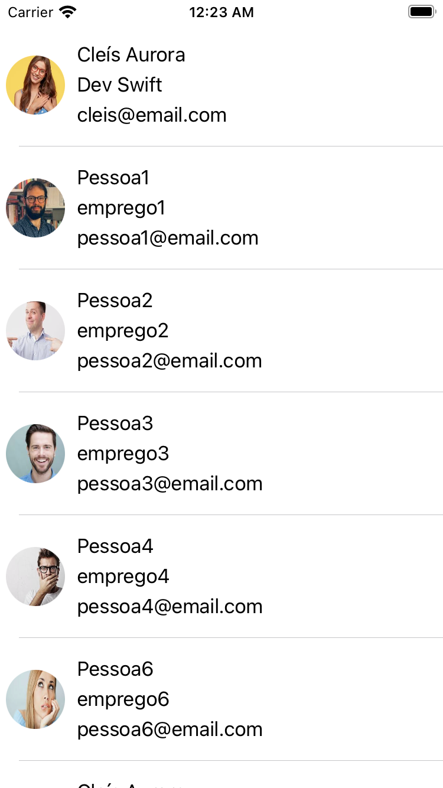
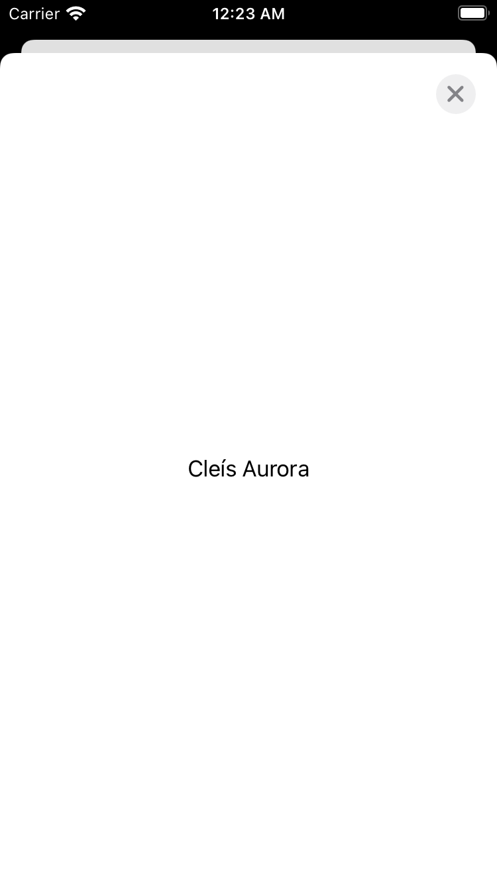
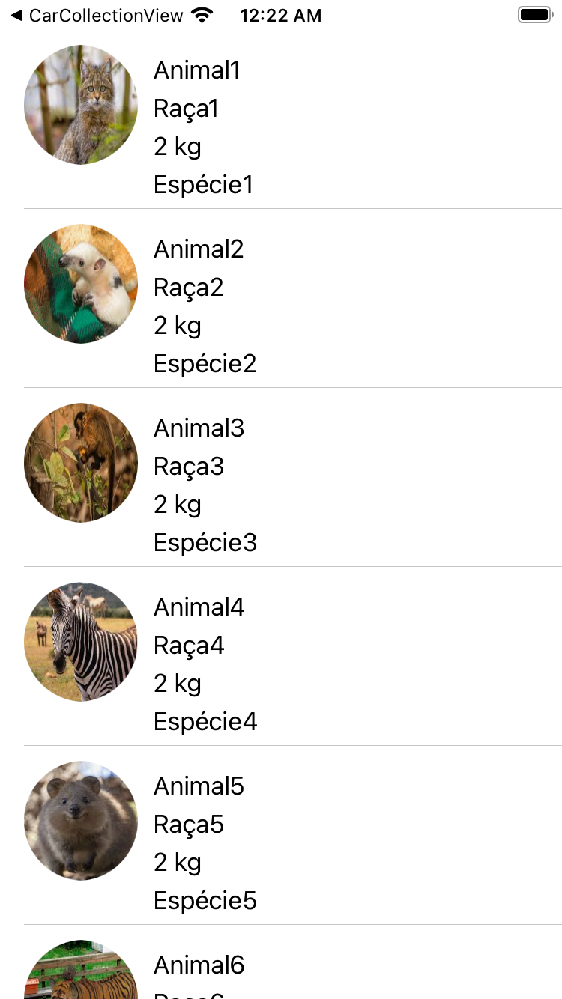
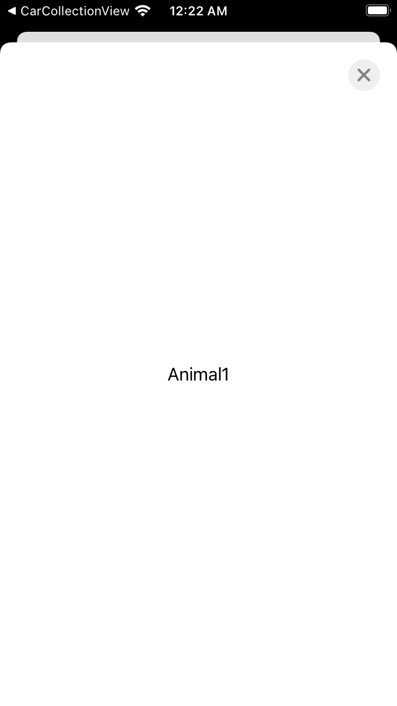

# SwiftExercises
Exercícios para treinar Modal, Push, TableView e CollectionView

01 - Criar um app:
- Tenha uma lista (tableView) com 15 pessoas.
- Cada célula (linha) deve ter o nome, cargo e email de uma pessoa.
- Quando tocar numa celula, deve abrir uma tela em modal, nessa tela deve haver um botão de fechar e um label com o nome da pessoa.

02 - Criar um app:
- Tenha uma lista (tableView) com 10 animais.
- Cada célula (linha) deve ter o nome, raça, peso e espécie de um animal.
- Quando tocar numa celula, deve abrir uma tela em modal, nessa tela deve haver um botão de fechar e um label com o nome do animal.

03 - Criar um app:
- Tenha uma collectionview com 10 carros na vertical;
- Cada célula deve ter o nome e a imagem do carro; (pode repetir a mesma imagem)
- Quando tocar numa celula, deve abrir uma tela via navigation (push), nessa tela deve haver a imagem grande.

04 - Criar um app:
- Tenha uma collectionview com 20 nomes na horizontal;
- Cada célula deve ter um nome numa label, e o background da celula ser cinza fraco;
- Ao tocar na celula, reve remover ela da collectionview, do array e recarregar.

